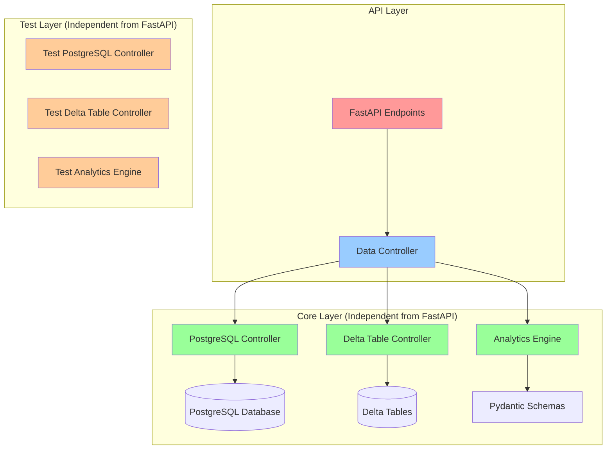

# Crypto Analytics Architecture Plan

## Overview

This document describes the architecture for extracting functionality from the Jupyter Notebook (`plot.py`) into independent, testable modules that can be integrated with the FastAPI application.

**Note**: All configurations are managed through environment variables (.env file).

## Architecture Diagram



## Module Structure

### 1. PostgreSQL Controller (`backend/core/db/postgres_controller.py`)

**Purpose**: Handles all PostgreSQL database operations for Bitcoin quotes.

**Responsibilities**:
- Establish connection to PostgreSQL database
- Query Bitcoin price quotes from `quotes` table
- Return data in Polars DataFrame format
- Handle connection lifecycle and errors

**Key Methods**:
```python
class PostgreSQLController:
    def __init__(self, connection_params: dict)
    def get_btc_quotes(self, start_date: str, end_date: str) -> pl.DataFrame
    def close(self)
    def __enter__(self)
    def __exit__(self, exc_type, exc_val, exc_tb)
```

**Dependencies**:
- `psycopg2` for database connection
- `polars` for data manipulation
- `pandas` (for compatibility with existing code)

**Configuration** (from `.env`):
```
POSTGRES_DB=btc
POSTGRES_USER=postgres
POSTGRES_PASSWORD=dbadmin1975
POSTGRES_HOST=postgres17
POSTGRES_PORT=5432
```

---

### 2. Delta Table Controller (`backend/core/db/delta_controller.py`)

**Purpose**: Handles all Delta table operations for Bitcoin address transactions.

**Responsibilities**:
- Read input transactions from Delta tables
- Read output transactions from Delta tables
- Handle partition-based queries (CRC32 hashing)

**Key Methods**:
```python
class DeltaTableController:
    def __init__(self, table_paths: dict)
    def get_input_transactions(self, address: str) -> pl.DataFrame
    def get_output_transactions(self, address: str) -> pl.DataFrame
    def get_pnl_stats(self, date: str) -> pl.DataFrame
```

**Dependencies**:
- `deltalake` for Delta table operations
- `polars` for data manipulation
- `zlib` for CRC32 partition hashing

**Configuration** (from `.env`):
```
# Delta table paths
INPUTS_ADDRESS_VIEW=/data/btc/views/inputs_address
OUTPUTS_ADDRESS_VIEW=/data/btc/views/outputs_address
PNL_STATS=/data/btc/pnl_stats
```

**Partition Logic**:
```python
partition = zlib.crc32(address.encode('utf-8')) % 1000
```

---

### 3. Data Controller / Analytics Engine (`backend/core/services/crypto_analytics.py`)

**Purpose**: Orchestrates data retrieval and performs financial calculations for Bitcoin addresses.

**Responsibilities**:
- Coordinate PostgreSQL and Delta Table controllers
- Calculate profit/loss for addresses
- Compute Sharpe ratio and drawdown
- Calculate exposure and days in market
- Generate benchmark comparisons
- Return structured results

**Key Methods**:
```python
class CryptoAnalytics:
    def __init__(self, postgres_controller: PostgreSQLController, 
                 delta_controller: DeltaTableController)
    def get_address_transactions(self, btc_address: str) -> dict
    def get_address_balance(self, btc_address: str) -> pl.DataFrame
    def get_benchmark_metrics(self) -> dict
    def get_top_addresses_by_profit(self, date: str, filters: dict) -> list
```

**Return Data Structure**:
```python
{
    "address": "bc1q...",
    "profit_pct": 0.45,
    "sharpe_ratio": 1.23,
    "drawdown": -0.15,
    "exposure": 0.75,
    "count_days_in_market": 365,
    "benchmark_profit": 0.30,
    "benchmark_sharpe": 0.95,
    "benchmark_drawdown": -0.20,
    "balance_history": pl.DataFrame
}
```

**Dependencies**:
- `polars` for data manipulation
- `pandas` for empyrical calculations
- `empyrical` for financial metrics
- `numpy` for numerical operations

---

### 4. Pydantic Schemas (`backend/core/models/schemas.py`)

**Purpose**: Define data models for type safety and validation.

**Key Schemas**:
```python
class AddressStats(BaseModel):
    address: str
    profit_pct: float
    sharpe_ratio: float
    drawdown: float
    exposure: float
    count_days_in_market: int
    benchmark_profit: float
    benchmark_sharpe: float
    benchmark_drawdown: float

class BitcoinQuote(BaseModel):
    date_: date
    close_: float

class Transaction(BaseModel):
    t_time: datetime
    address: str
    t_value: int
    t_usdvalue: float
```

---

## Directory Structure

```
backend/
├── core/
│   ├── __init__.py
│   ├── db/
│   │   ├── __init__.py
│   │   ├── postgres_controller.py
│   │   └── delta_controller.py
│   ├── services/
│   │   ├── __init__.py
│   │   └── crypto_analytics.py
│   └── models/
│       ├── __init__.py
│       └── schemas.py
├── tests/
│   ├── core/
│   │   ├── __init__.py
│   │   ├── test_postgres_controller.py
│   │   ├── test_delta_controller.py
│   │   └── test_crypto_analytics.py
│   └── fixtures/
│       └── sample_data.py
├── app/
│   ├── app.py
│   ├── config.py
│   └── schemas.py (existing)
└── requirements.txt
```

---

## Dependencies

### New Dependencies to Add:
```
psycopg2-binary==2.9.9
polars==0.20.0
pandas==2.1.0
deltalake==0.15.0
pyarrow==14.0.0
empyrical==0.5.5
pyfolio==0.9.2
numpy==1.26.0
pytest==7.4.0
pytest-cov==4.1.0
```

---

## Testing Strategy

### Test Independence

All tests will be independent of FastAPI and can run directly:

```bash
# Run all core tests
pytest backend/tests/core/

# Run specific test
pytest backend/tests/core/test_postgres_controller.py

# Run with coverage
pytest backend/tests/core/ --cov=backend/core --cov-report=html
```

### Test Fixtures

Mock data will be provided in `backend/tests/fixtures/sample_data.py`:
- Sample Bitcoin quotes
- Sample input/output transactions
- Sample address statistics

### Test Categories

1. **PostgreSQL Controller Tests**:
   - Connection handling
   - Query execution
   - Data format validation
   - Error handling

2. **Delta Table Controller Tests**:
   - Partition calculation
   - Data retrieval
   - Storage options handling
   - Error handling

3. **Analytics Engine Tests**:
   - Profit/loss calculations
   - Sharpe ratio calculations
   - Drawdown calculations
   - Benchmark comparisons
   - Edge cases (empty data, negative values, etc.)

---

## Integration with FastAPI

After core modules are tested, integrate with FastAPI:

```python
# backend/app/app.py
from core.services.crypto_analytics import CryptoAnalytics
from core.db.postgres_controller import PostgreSQLController
from core.db.delta_controller import DeltaTableController

# Initialize controllers
postgres_controller = PostgreSQLController(settings.postgres_connection_params)
delta_controller = DeltaTableController(settings.table_paths)
analytics = CryptoAnalytics(postgres_controller, delta_controller)

@app.get("/api/address/{address}/stats")
def get_address_stats(address: str):
    return analytics.get_address_transactions(address)

@app.get("/api/address/{address}/balance")
def get_address_balance(address: str):
    df = analytics.get_address_balance(address)
    return df.to_dict()
```

---

## Configuration Updates

### backend/app/config.py

Add new configuration properties:

```python
class Settings:
    # ... existing settings ...
    
    # PostgreSQL Configuration
    postgres_db: str = os.getenv("POSTGRES_DB", "btc")
    postgres_user: str = os.getenv("POSTGRES_USER", "postgres")
    postgres_password: str = os.getenv("POSTGRES_PASSWORD", "")
    postgres_host: str = os.getenv("POSTGRES_HOST", "localhost")
    postgres_port: int = int(os.getenv("POSTGRES_PORT", "5432"))
    
    # Delta Table Paths
    inputs_address_view: str = os.getenv("INPUTS_ADDRESS_VIEW", "")
    outputs_address_view: str = os.getenv("OUTPUTS_ADDRESS_VIEW", "")
    pnl_stats: str = os.getenv("PNL_STATS", "")
    
    @property
    def postgres_connection_params(self) -> dict:
        return {
            "database": self.postgres_db,
            "user": self.postgres_user,
            "password": self.postgres_password,
            "host": self.postgres_host,
            "port": self.postgres_port
        }
    
    @property
    def table_paths(self) -> dict:
        return {
            "inputs": self.inputs_address_view,
            "outputs": self.outputs_address_view,
            "pnl_stats": self.pnl_stats
        }
```

### backend/.env

Add new environment variables:

```env
# Existing variables
SYSTEM_ENV=dev
DEBUG=true
PORT=8002
HOST=0.0.0.0

# PostgreSQL Configuration
POSTGRES_DB=btc
POSTGRES_USER=postgres
POSTGRES_PASSWORD=dbadmin1975
POSTGRES_HOST=postgres17
POSTGRES_PORT=5432

# Delta Table Paths
INPUTS_ADDRESS_VIEW=/data/btc/views/inputs_address
OUTPUTS_ADDRESS_VIEW=/data/btc/views/outputs_address
PNL_STATS=/data/btc/pnl_stats
```

---

## Implementation Order

1. **Phase 1: Core Infrastructure**
   - Update `requirements.txt`
   - Create directory structure
   - Update `config.py` with new settings
   - Update `.env` with new environment variables
   - Create Pydantic schemas

2. **Phase 2: Database Controllers**
   - Implement PostgreSQL Controller
   - Implement Delta Table Controller
   - Write unit tests for both controllers

3. **Phase 3: Analytics Engine**
   - Implement CryptoAnalytics service
   - Write unit tests for analytics

4. **Phase 4: Integration**
   - Add FastAPI endpoints
   - Integration tests
   - Documentation updates

---

## Key Considerations

1. **Error Handling**: All controllers should handle database connection errors gracefully
2. **Resource Management**: Use context managers for database connections
3. **Type Safety**: Use type hints throughout for better IDE support
4. **Performance**: Consider connection pooling for PostgreSQL
5. **Security**: Never log sensitive credentials
6. **Testing**: Mock external dependencies in tests
7. **Documentation**: Add docstrings to all public methods

---

## Next Steps

Once this plan is approved, switch to Code mode to implement the modules in the order specified above.
